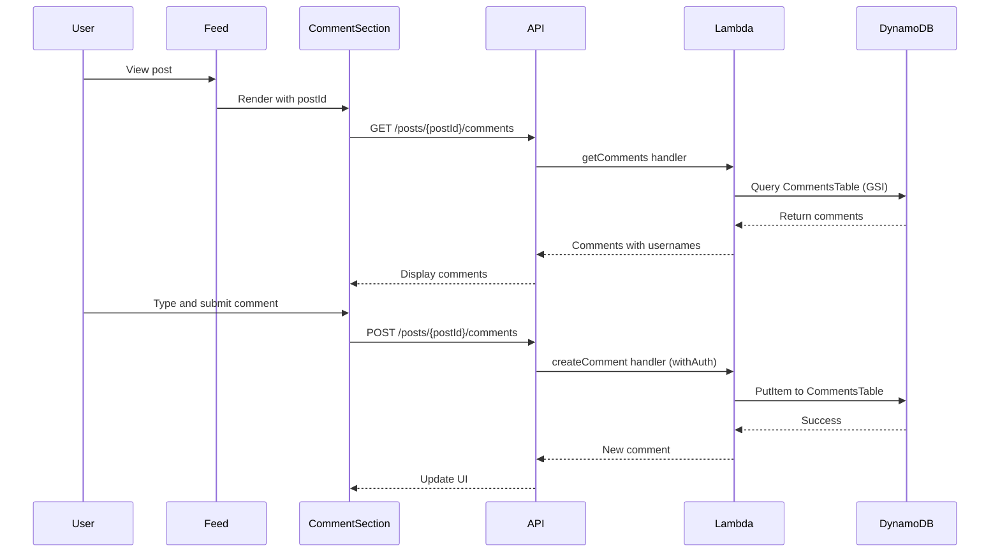

# Design Document: Post Comments

## Overview

The post comments feature enables users to engage in conversations around posts by adding text comments. This design integrates seamlessly with the existing serverless architecture, leveraging the pre-existing CommentsTable in DynamoDB, Lambda functions for backend logic, and React components for the frontend UI.

The implementation follows the established patterns in the codebase:
- Backend: Lambda functions with `withAuth` middleware for authentication
- Frontend: React components with centralized API client
- Data: DynamoDB queries using the postId-createdAt GSI for efficient retrieval

## Architecture

### High-Level Flow

```
User → Feed UI → API Client → API Gateway → Lambda Function → DynamoDB
                                                    ↓
                                            CommentsTable
```

### Component Interaction



## Components and Interfaces

### Backend Components

#### 1. Create Comment Lambda (`backend/src/functions/comments/createComment.js`)

**Purpose**: Handle comment creation with authentication and validation

**Handler Signature**:
```javascript
exports.handler = withAuth(async (event) => {
  // Returns: { statusCode, headers, body }
});
```

**Input** (from event.body):
```javascript
{
  postId: string,      // UUID of the post
  text: string         // Comment text (1-280 chars)
}
```

**Output**:
```javascript
{
  id: string,          // UUID of new comment
  postId: string,
  userId: string,
  username: string,
  text: string,
  createdAt: string    // ISO 8601 timestamp
}
```

**Logic**:
1. Extract authenticated userId and username from event.user (added by withAuth)
2. Parse and validate request body (text length, required fields)
3. Generate unique comment ID using uuid
4. Create timestamp
5. Store comment in CommentsTable
6. Return comment data with CORS headers

#### 2. Get Comments Lambda (`backend/src/functions/comments/getComments.js`)

**Purpose**: Retrieve all comments for a specific post

**Handler Signature**:
```javascript
exports.handler = async (event) => {
  // Returns: { statusCode, headers, body }
};
```

**Input** (from path parameters):
```javascript
{
  postId: string       // UUID of the post
}
```

**Query Parameters** (optional):
```javascript
{
  limit: number,       // Max comments to return (default: 50)
  lastKey: string      // For pagination (encoded)
}
```

**Output**:
```javascript
{
  comments: [
    {
      id: string,
      postId: string,
      userId: string,
      username: string,
      text: string,
      createdAt: string
    }
  ],
  lastKey: string | null  // For pagination
}
```

**Logic**:
1. Extract postId from path parameters
2. Query CommentsTable using postId-createdAt GSI
3. Sort by createdAt ascending (oldest first)
4. Apply pagination if needed
5. Return comments array with CORS headers

### Frontend Components

#### 1. CommentSection Component (`frontend/src/components/CommentSection.tsx`)

**Purpose**: Display comments and comment input for a post

**Props**:
```typescript
interface CommentSectionProps {
  postId: string;
  initialCommentCount?: number;
}
```

**State**:
```typescript
{
  comments: Comment[],
  loading: boolean,
  error: string | null,
  submitting: boolean
}
```

**Behavior**:
- Fetch comments on mount using postId
- Display list of comments with author and timestamp
- Render CommentInput component
- Handle new comment submissions
- Update local state optimistically

#### 2. CommentInput Component (`frontend/src/components/CommentInput.tsx`)

**Purpose**: Input field for creating new comments

**Props**:
```typescript
interface CommentInputProps {
  postId: string;
  onCommentCreated: (comment: Comment) => void;
}
```

**State**:
```typescript
{
  text: string,
  charCount: number,
  submitting: boolean,
  error: string | null
}
```

**Behavior**:
- Track character count (max 280)
- Validate input before submission
- Call API to create comment
- Clear input on success
- Show error messages on failure

#### 3. CommentItem Component (`frontend/src/components/CommentItem.tsx`)

**Purpose**: Display a single comment

**Props**:
```typescript
interface CommentItemProps {
  comment: Comment;
}
```

**Rendering**:
- Username (bold)
- Comment text
- Relative timestamp (e.g., "2 hours ago")
- Consistent styling with post design

### API Client Extensions (`frontend/src/services/api.ts`)

**New Methods**:

```typescript
// Get comments for a post
async getComments(postId: string, limit?: number, lastKey?: string): Promise<{
  comments: Comment[];
  lastKey: string | null;
}>

// Create a new comment
async createComment(postId: string, text: string): Promise<Comment>
```

### Infrastructure Updates (`infrastructure/lib/app-stack.ts`)

**Lambda Functions**:
- `CreateCommentFunction`: POST /posts/{postId}/comments
- `GetCommentsFunction`: GET /posts/{postId}/comments

**API Gateway Routes**:
- POST /posts/{postId}/comments → CreateCommentFunction
- GET /posts/{postId}/comments → GetCommentsFunction

**IAM Permissions**:
- CreateCommentFunction: dynamodb:PutItem on CommentsTable
- GetCommentsFunction: dynamodb:Query on CommentsTable (postId-createdAt GSI)

**Environment Variables** (passed to Lambdas):
- COMMENTS_TABLE_NAME
- USERS_TABLE_NAME (for username lookup in createComment)

## Data Models

### Comment Model

**DynamoDB Schema** (CommentsTable):
```javascript
{
  id: string,              // PK - UUID
  postId: string,          // GSI partition key
  userId: string,          // Author's user ID
  username: string,        // Denormalized for display
  text: string,            // Comment content (1-280 chars)
  createdAt: string        // GSI sort key - ISO 8601 timestamp
}
```

**TypeScript Interface** (Frontend):
```typescript
interface Comment {
  id: string;
  postId: string;
  userId: string;
  username: string;
  text: string;
  createdAt: string;
}
```

### Validation Rules

- `text`: Required, 1-280 characters, trimmed
- `postId`: Required, valid UUID format
- `userId`: Extracted from JWT, must exist in UsersTable
- `username`: Denormalized from user data at creation time
- `createdAt`: ISO 8601 format, server-generated

## Correctness Properties

*A property is a characteristic or behavior that should hold true across all valid executions of a system—essentially, a formal statement about what the system should do. Properties serve as the bridge between human-readable specifications and machine-verifiable correctness guarantees.*


### Property 1: Comment Creation Stores All Required Fields

*For any* valid comment text and post ID, when a comment is created by an authenticated user, the stored comment should contain the comment ID, post ID, user ID, username, text, and timestamp.

**Validates: Requirements 1.1, 1.4**

### Property 2: Whitespace Comments Are Invalid

*For any* string composed entirely of whitespace characters (spaces, tabs, newlines), attempting to create a comment with that text should be rejected, and no comment should be stored.

**Validates: Requirements 1.2**

### Property 3: Character Limit Validation

*For any* string exceeding 280 characters, attempting to create a comment with that text should be rejected with a validation error.

**Validates: Requirements 1.3**

### Property 4: UI Clears After Submission

*For any* valid comment submission, after the comment is successfully created, the input field should be empty and the new comment should appear in the comments list.

**Validates: Requirements 1.5**

### Property 5: Complete Comment Retrieval

*For any* post with N comments, retrieving comments for that post should return all N comments with no duplicates or omissions.

**Validates: Requirements 2.1**

### Property 6: Comment Display Contains Required Information

*For any* comment, the rendered comment display should include the author's username, the comment text, and a timestamp.

**Validates: Requirements 2.2, 3.4**

### Property 7: Chronological Ordering

*For any* set of comments on a post, when retrieved, the comments should be ordered by creation timestamp in ascending order (oldest first).

**Validates: Requirements 2.3, 3.2**

### Property 8: Pagination Correctness

*For any* post with more comments than the page limit, pagination should return non-overlapping subsets that together contain all comments exactly once.

**Validates: Requirements 3.3**

### Property 9: Authentication Required for Creation

*For any* comment creation request without a valid JWT token, the request should be rejected with an authentication error.

**Validates: Requirements 4.1, 4.2**

### Property 10: Comment Ownership

*For any* comment created by an authenticated user, the stored comment's userId field should match the authenticated user's ID from the JWT token.

**Validates: Requirements 4.3**

### Property 11: Authenticated Read Access

*For any* authenticated user and any post, the user should be able to retrieve and view all comments on that post.

**Validates: Requirements 4.4**

### Property 12: Unique Comment IDs

*For any* set of comments created in the system, all comment IDs should be unique with no collisions.

**Validates: Requirements 5.1**

### Property 13: Post Existence Validation

*For any* comment creation request with a non-existent post ID, the request should be rejected with a validation error.

**Validates: Requirements 5.2**

### Property 14: Character Counter Accuracy

*For any* text input in the comment field, the displayed character counter should show the correct number of remaining characters (280 minus current length).

**Validates: Requirements 6.3**

## Error Handling

### Backend Error Scenarios

**Validation Errors** (400 Bad Request):
- Empty or whitespace-only comment text
- Comment text exceeding 280 characters
- Missing required fields (postId, text)
- Invalid postId format
- Non-existent postId

**Authentication Errors** (401 Unauthorized):
- Missing JWT token
- Invalid or expired JWT token
- Malformed authorization header

**Server Errors** (500 Internal Server Error):
- DynamoDB operation failures
- Unexpected exceptions during processing
- UUID generation failures

**Error Response Format**:
```javascript
{
  statusCode: number,
  headers: { /* CORS headers */ },
  body: JSON.stringify({
    error: string,        // Error type
    message: string       // Human-readable description
  })
}
```

### Frontend Error Handling

**Network Errors**:
- Display user-friendly message: "Unable to load comments. Please try again."
- Retry mechanism for failed requests
- Loading states during API calls

**Validation Errors**:
- Show inline error messages below input field
- Disable submit button when validation fails
- Clear errors when user corrects input

**Authentication Errors**:
- Redirect to login page
- Preserve intended action for post-login redirect

**Graceful Degradation**:
- Show empty state when comments fail to load
- Allow retry without page refresh
- Maintain UI responsiveness during errors

## Testing Strategy

### Dual Testing Approach

This feature requires both unit tests and property-based tests for comprehensive coverage:

**Unit Tests**: Verify specific examples, edge cases, and error conditions
- Empty comment submission
- Exactly 280 character comment
- Unauthenticated request handling
- Non-existent post ID
- Empty comments list display
- Malformed data handling

**Property Tests**: Verify universal properties across all inputs
- Comment creation with random valid inputs
- Whitespace validation across all whitespace combinations
- Character limit validation with random lengths
- Chronological ordering with random timestamps
- Pagination with varying comment counts
- Authentication validation with various token states

### Property-Based Testing Configuration

**Library Selection**:
- **Backend (JavaScript)**: Use `fast-check` for property-based testing
- **Frontend (TypeScript)**: Use `fast-check` for property-based testing

**Test Configuration**:
- Minimum 100 iterations per property test
- Each property test must reference its design document property
- Tag format: `Feature: post-comments, Property {number}: {property_text}`

**Example Property Test Structure**:
```javascript
// Backend: createComment validation
describe('Feature: post-comments, Property 2: Whitespace comments are invalid', () => {
  it('should reject comments with only whitespace', async () => {
    await fc.assert(
      fc.asyncProperty(
        fc.stringOf(fc.constantFrom(' ', '\t', '\n', '\r')),
        async (whitespaceText) => {
          const result = await createComment(postId, whitespaceText, userId);
          expect(result.statusCode).toBe(400);
        }
      ),
      { numRuns: 100 }
    );
  });
});
```

### Integration Testing

**API Integration Tests**:
- Test complete flow: create comment → retrieve comments
- Verify CORS headers on all responses
- Test pagination with real DynamoDB queries
- Verify GSI query performance

**Frontend Integration Tests**:
- Test CommentSection component with real API calls (mocked)
- Verify optimistic UI updates
- Test error recovery flows
- Verify character counter updates in real-time

### End-to-End Testing

**Playwright E2E Tests**:
- User creates a comment on a post
- User views comments on multiple posts
- User sees character counter while typing
- User receives validation errors for invalid input
- Comments persist across page refreshes
- Comments appear in chronological order

## Implementation Notes

### Performance Considerations

**DynamoDB Query Optimization**:
- Use postId-createdAt GSI for efficient comment retrieval
- Implement pagination to limit response size
- Consider caching frequently accessed comments

**Frontend Optimization**:
- Optimistic UI updates for better perceived performance
- Debounce character counter updates
- Lazy load comments for posts not in viewport
- Use React.memo for CommentItem to prevent unnecessary re-renders

### Security Considerations

**Input Sanitization**:
- Trim whitespace from comment text before storage
- Escape HTML/JavaScript in comment text for display
- Validate all inputs on both frontend and backend

**Authentication**:
- Verify JWT signature and expiration
- Use withAuth middleware consistently
- Never trust client-provided userId

**Rate Limiting** (Future Enhancement):
- Consider implementing rate limits on comment creation
- Prevent spam and abuse

### Scalability Considerations

**Database Design**:
- GSI supports efficient queries by postId
- Pagination prevents large response payloads
- Consider comment count limits per post if needed

**Caching Strategy** (Future Enhancement):
- Cache recent comments in CloudFront
- Invalidate cache on new comment creation
- Use short TTL for comment data

### Monitoring and Observability

**Metrics to Track**:
- Comment creation success/failure rates
- Average comment retrieval latency
- GSI query performance
- Validation error rates by type

**Logging**:
- Log all comment creation attempts
- Log validation failures with reason
- Log authentication failures
- Include request IDs for tracing
